```mermaid
classDiagram
    direction LR

    class InstrumentId {
        +value : uint64
    }
    class OrderId {
        +value : uint64
    }
    class Timestamp {
        +unix_nanos : int64
    }
    class VenueId {
        +value : uint32
    }
    class SourceId {
        +value : uint32
    }
    class VenueReference {
        +id : VenueId
        +code : string
    }
    class VenueReferenceTable {
        +add(VenueReference)
        +find(VenueId)
    }
    class SourceMetadata {
        +id : SourceId
        +provider : string
        +dataset : string optional
        +schema : string optional
    }
    class SourceMetadataTable {
        +add(SourceMetadata)
        +find(SourceId)
    }
    class InstrumentType {
        Equity
        Option
        Future
        Other
    }
    class CurrencyCode {
        +value : string
    }
    class DecimalInput {
        +coefficient : int64
        +scale : uint8
    }
    class Price {
        +raw : int64
        +canonical_scale : uint8 = 9
    }
    class Quantity {
        +raw : int64
        +canonical_scale : uint8 = 6
    }
    class Money {
        +currency : CurrencyCode
        +amount : int64
        +canonical_scale : uint8 = 2
    }
    class Side {
        Buy
        Sell
    }
    class MboAction {
        Add
        Modify
        Cancel
        Execute
        Clear
    }

    class ReferenceHistory {
        +append(ReferenceVersion)
        +at(Timestamp)
    }
    class ReferenceVersion {
        +valid_from : Timestamp
        +valid_until : Timestamp optional
        +symbol : string
        +type : InstrumentType
        +currency : CurrencyCode optional
        +tick_size : Price optional
        +lot_size : Quantity optional
    }

    class EventHeader {
        +instrument_id : InstrumentId
        +venue_id : VenueId
        +event_time : Timestamp
        +source_receive_time : Timestamp optional
        +sequence : uint64 optional
        +channel_id : uint32 optional
        +source_flags : uint64
        +source_id : SourceId
    }
    class MboEvent {
        +action : MboAction
        +order_id : OrderId optional
        +side : Side optional
        +price : Price optional
        +quantity : Quantity optional
    }
    class MboAdd {
        +header : EventHeader
        +order_id : OrderId
        +side : Side
        +price : Price
        +quantity : Quantity
    }
    class MboModify {
        +header : EventHeader
        +order_id : OrderId
        +side : Side optional
        +price : Price optional
        +quantity : Quantity optional
    }
    class MboCancel {
        +header : EventHeader
        +order_id : OrderId
        +quantity : Quantity
    }
    class MboExecute {
        +header : EventHeader
        +order_id : OrderId
        +quantity : Quantity
    }
    class MboClear {
        +header : EventHeader
    }
    class MboStreamContext {
        +instrument_id : InstrumentId
        +venue_id : VenueId
        +source_id : SourceId
    }
    class MboRecord {
        +event_time : int64
        +source_receive_time : int64
        +sequence : uint64
        +order_id : uint64
        +price : int64
        +quantity : int64
        +source_flags : uint64
        +channel_id : uint32
        +control : uint32
        +fixed_stride : 64 bytes
        +alignment : 64 bytes
    }
    class MboRecordView {
        +action()
        +header()
        +as_add()
        +as_modify()
        +as_cancel()
        +as_execute()
        +as_clear()
    }
    class MboBuffer {
        +append(typed MBO)
        +begin()
        +end()
        +size()
    }
    class Trade {
        +price : Price
        +quantity : Quantity
        +aggressor_side : Side optional
    }
    class Quote {
        +bid_price : Price optional
        +bid_quantity : Quantity optional
        +ask_price : Price optional
        +ask_quantity : Quantity optional
    }
    class L2View {
        +price_levels
    }
    class Bar {
        +interval_start : Timestamp
        +interval_end : Timestamp
        +open : Price
        +high : Price
        +low : Price
        +close : Price
        +volume : Quantity
    }
    class MarketState {
        +state_at(Timestamp)
    }
    class DataState {
        +state_at(Timestamp)
    }
    class ValidationIssues {
        +code : string
        +message : string
    }

    class OriginalPool {
        +observed_records
    }
    class TransformedPool {
        +derived_records
    }
    class LineageNode {
        +parents
        +operation
        +parameters
        +code_version
    }
    class Revision {
        +original_event
        +correction
    }
    class Snapshot {
        +history_position
        +derived_state
    }

    InstrumentId "1" --> "1" ReferenceHistory : keys
    ReferenceHistory "1" *-- "0..*" ReferenceVersion : stores
    ReferenceVersion --> InstrumentId : identifies
    ReferenceVersion --> InstrumentType
    ReferenceVersion --> CurrencyCode
    ReferenceVersion --> Price : tick size
    ReferenceVersion --> Quantity : lot size

    VenueReferenceTable "1" *-- "0..*" VenueReference : maps
    SourceMetadataTable "1" *-- "0..*" SourceMetadata : maps

    Price ..> DecimalInput : normalizes at boundary
    Quantity ..> DecimalInput : normalizes at boundary
    Money ..> DecimalInput : normalizes at boundary
    Money --> CurrencyCode

    EventHeader --> InstrumentId : identifies
    EventHeader --> VenueId : compact scope id
    EventHeader --> Timestamp
    EventHeader --> SourceId : compact source id
    MboEvent *-- EventHeader
    Trade *-- EventHeader
    Quote *-- EventHeader
    Bar *-- EventHeader
    MboEvent --> OrderId
    MboEvent --> Side
    MboEvent --> MboAction
    MboEvent --> Price
    MboEvent --> Quantity
    MboAdd *-- EventHeader
    MboModify *-- EventHeader
    MboCancel *-- EventHeader
    MboExecute *-- EventHeader
    MboClear *-- EventHeader
    MboBuffer *-- "0..*" MboRecord : contiguous fixed stride
    MboBuffer *-- MboStreamContext : shared scope
    MboRecordView --> MboRecord : reads
    MboRecordView --> MboStreamContext : restores header scope
    MboRecordView ..> MboAdd : typed view
    MboRecordView ..> MboModify : typed view
    MboRecordView ..> MboCancel : typed view
    MboRecordView ..> MboExecute : typed view
    MboRecordView ..> MboClear : typed view
    Trade --> Price
    Trade --> Quantity
    Quote --> Price
    Quote --> Quantity
    Bar --> Price
    Bar --> Quantity

    MboEvent ..> Trade : distinct concepts
    MboEvent ..> L2View : can derive
    L2View ..> Quote : can derive
    Trade ..> Bar : can derive
    MboEvent ..> ValidationIssues : validated by
    Trade ..> ValidationIssues : validated by
    Quote ..> ValidationIssues : validated by
    Bar ..> ValidationIssues : validated by

    OriginalPool "1" o-- "0..*" MboEvent : observed
    OriginalPool "1" o-- "0..*" Trade : observed
    OriginalPool "1" o-- "0..*" Quote : observed
    OriginalPool "1" o-- "0..*" Bar : observed
    TransformedPool "1" o-- "0..*" L2View : derived
    TransformedPool "1" o-- "0..*" Bar : derived
    TransformedPool "1" o-- "0..*" LineageNode : traces
    LineageNode --> OriginalPool : parent history
    LineageNode --> TransformedPool : descendant
    Revision --> OriginalPool : preserves history
    Revision --> Revision : revision history
    Snapshot --> TransformedPool : recovery checkpoint
    MarketState ..> EventHeader : reduced from state events
    DataState ..> EventHeader : reduced from quality events
```

## Iteration 2 — implemented concrete type and MBO layout

The Mermaid model retains `MboEvent` as the logical/action-aware boundary shape and shows the concrete physical records beside it. Iteration 2 implements the following choices:

- `VenueId` and `SourceId` are non-zero `uint32_t` values. `VenueReferenceTable` and `SourceMetadataTable` own human-readable and provider/source strings outside event records.
- `Price`, `Quantity`, and `Money` store one signed `int64_t` canonical integer. Their scales are respectively 9 decimal places, 6 decimal places, and 2 decimal places.
- `DecimalInput` is boundary-only input. Upscaling checks for `int64_t` overflow; downscaling rejects non-zero discarded digits instead of rounding. Same-scale arithmetic is checked; mixed-currency money arithmetic is rejected.
- `MboAdd`, `MboModify`, `MboCancel`, `MboExecute`, and `MboClear` provide typed writer inputs. `MboBuffer` is scoped to one instrument/venue/source context and rejects records from another scope.
- `MboRecord` is 64 bytes with 64-byte alignment. It stores event-local times, sequence, order payload, source flags, channel, and a control word containing the action and presence bits. The shared `MboStreamContext` avoids repeating stream scope in every record while views restore the complete `EventHeader`.
- Records are stored in a synchronous, single-threaded `std::vector<MboRecord>`. `MboRecordView` provides action-aware access and typed views without changing the fixed physical stride.
- The benchmark measures actual object sizes, padding, alignment, cache-line crossings, sequential traversal, and logical payload memory for 32/40/48/64-byte candidates. On the recorded arm64 run, only the 64-byte candidate carries the complete chosen semantics and occupies one cache line without crossings.
- For 1,000,000 records, the selected fixed layout uses 64,000,000 bytes. The documented 70% 64-byte / 30% 32-byte hypothetical variable layout uses 54,400,000 bytes, a 9,600,000-byte (15%) premium for fixed stride.
