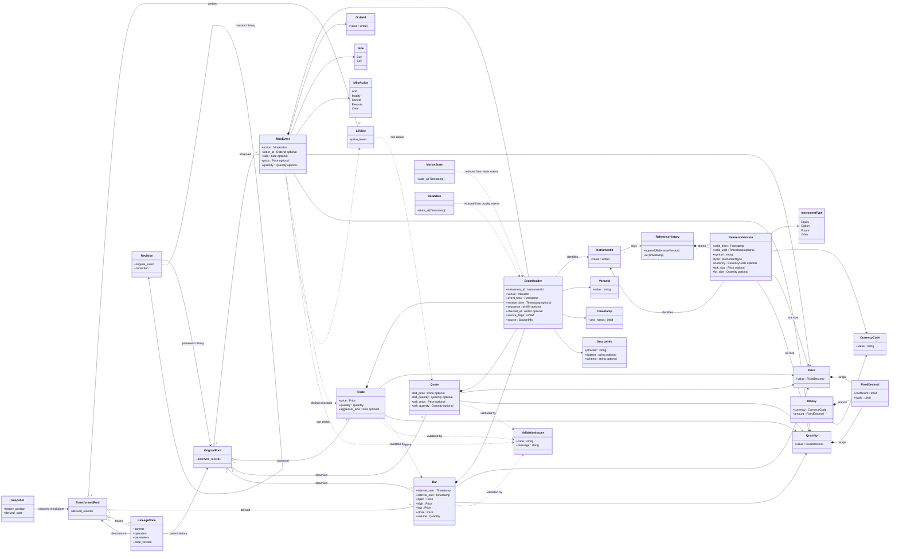

## Iteration 2 — accepted MBO physical-layout direction

The Mermaid model above remains the logical/current Iteration 1 model. For the second implementation/performance pass, use a Databento-inspired fixed-size MBO record as the first physical-layout candidate rather than storing action-specific variable-length records or the current collection of independent `std::optional` fields.

- Keep typed construction at the writer boundary (`Add`, `Modify`, `Cancel`, `Execute`, `Clear` semantics), then normalize into one compact fixed-size tagged MBO record.
- Store records contiguously and let consumers iterate with a constant stride. The writer → buffer → consumer model is initially synchronous; this decision does not introduce threading or lock-free queues.
- The action tag determines the semantics of the fixed payload fields. Actions such as `Clear` may leave some fixed slots unused; this deliberate space cost is traded for predictable layout, simple iteration, easier prefetch/cache behavior, and less per-record decoding logic.
- Preserve the option to expose typed consumer views even if the physical buffer is one fixed record type.
- Benchmark the actual record footprint before freezing the layout. Useful targets to test include 32, 40, 48, and 64 bytes, with cache-line interaction measured rather than assumed.
- Sizing sanity check discussed during design: with 1,000,000 records, a 64-byte fixed layout uses 64 MB. If 30% are `Clear` and a hypothetical variable-length layout could encode `Clear` in 32 bytes while all other records remain 64 bytes, the variable layout would use 54.4 MB. The fixed layout therefore spends 9.6 MB, about 15%, for the constant-stride representation in that example.
- Exact field widths, padding/alignment, sentinel/unused-field semantics, common-header layout, and the final record size remain Iteration 2 implementation/benchmark decisions.
