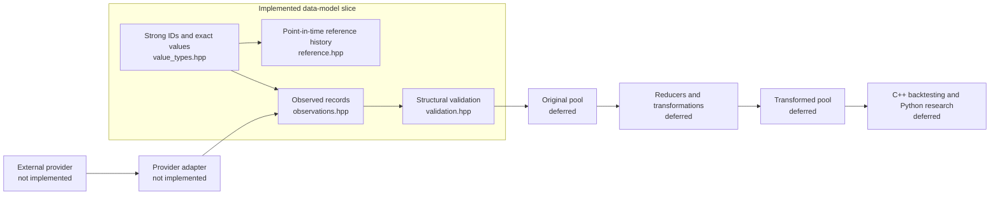

# Phase 1 Data Model — Implementation Iteration 1

## Status

- **Implemented:** The first executable C++20 slice of the accepted canonical market-data model.
- **Provisional:** The concrete C++ representation is an implementation pass, not a final freeze of the unresolved type, storage, or provider boundaries.
- **Deferred:** Provider adapters, storage, replay, reducers, lineage persistence, Python bindings, and backtesting remain outside this slice.

This document explains what the current files do and how they connect. The domain meaning remains defined by `phase1-data-model.md`.

## Boundary of this iteration



The current code stops after creating and checking canonical observed records. It does not silently introduce a database, event-sourcing framework, exchange simulator, or provider API.

## Files

```text
quant project/
├── src/quant/data/
│   ├── value_types.hpp       # IDs, timestamps, exact values, enums, provenance
│   ├── reference.hpp         # ReferenceVersion and ReferenceHistory
│   ├── observations.hpp      # EventHeader, MboEvent, Trade, Quote, Bar
│   └── validation.hpp        # Structural validation issues and checks
├── tests/
│   └── data_model_tests.cpp  # Executable invariant tests
└── docs/architecture/
    └── phase1-data-model-implementation.md
```

## Implemented concepts

### Value and identity types

- `InstrumentId` and `OrderId` are non-zero strong integer IDs.
- `VenueId` and `SourceInfo` keep venue/provider context explicit.
- `Timestamp` stores signed Unix nanoseconds.
- `FixedDecimal` stores an `int64` coefficient and decimal scale from 0 through 18; it does not accept binary floating-point input.
- `Price`, `Quantity`, and `Money` wrap exact values. `Quantity` rejects negative values.
- `CurrencyCode` is a three-letter uppercase code.

The coefficient and scale are retained as supplied to the value type, while comparisons use exact decimal value semantics. Arithmetic, scale conversion, overflow behavior, and the final physical representation remain open for the concrete type-design review.

### Reference history

`ReferenceHistory` stores ordered, non-overlapping `[valid_from, valid_until)` versions for one `InstrumentId`. A lookup at an event time returns the reference version valid at that time. Gaps are allowed so unknown reference periods are not fabricated.

### Observed records

`EventHeader` carries the common identity, venue, event time, optional receive time, optional provider sequence, optional channel, opaque source flags, and provenance.

The first record shapes are:

- `MboEvent`: an action plus optional order fields. `Add` requires a complete order description; `Modify` requires at least one changed order field; `Cancel` and `Execute` require quantity; `Clear` carries no order fields.
- `Trade`: price, positive quantity, and optional aggressor side. It remains separate from MBO execution events.
- `Quote`: optional bid and ask price/quantity pairs. A crossed quote is rejected.
- `Bar`: interval, OHLC prices, and volume. Intervals and OHLC range relationships are checked.

The action-plus-optional-fields representation is intentionally provisional. A variant-based action representation and provider-extension mechanism remain candidates for the concrete type review.

## Deliberately not implemented

- `L2` or `L1` reducers derived from MBO history.
- Order-book, market-state, or data-state reducers.
- Original/transformed pool storage or lineage DAG persistence.
- FGIT revision materialization and snapshots.
- Databento ingestion or any provider-specific schema.
- Query, replay, serialization, or schema evolution.
- C++/Python boundary or Python bindings.
- Orders, risk, execution, portfolio, PnL, and reporting.

## Verification

The test is framework-free so the repository does not acquire a test/build dependency before that decision is accepted:

```text
clang++ -std=c++20 -Wall -Wextra -Wpedantic -Werror -I src \
    tests/data_model_tests.cpp \
    -o /tmp/quant_data_model_tests
/tmp/quant_data_model_tests
```

The test covers exact decimal comparisons, value-type rejection, point-in-time reference lookup, non-overlapping reference intervals, MBO action invariants, and trade/quote/bar validation.

## Next design pass

Before adding adapters or storage, review:

1. Whether per-value coefficient/scale is the right final fixed-point representation.
2. Required and optional fields for each provider-independent record.
3. Whether MBO actions should become typed variants.
4. Overflow, arithmetic, tick-size, lot-size, and timestamp policies.
5. The concrete C++/Python ownership boundary.
