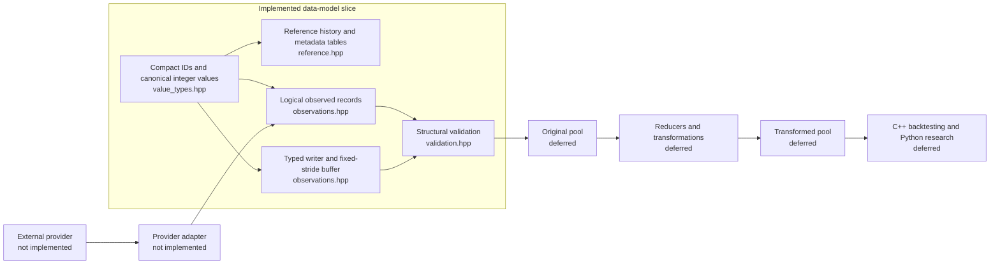

# Phase 1 Data Model — Implementation Iteration 2

## Status

- **Implemented:** The concrete C++20 value, identity, lookup, and MBO-buffer pass for the accepted Iteration 2 directions.
- **Finalized for this boundary:** Canonical integer scales, compact reference IDs, binary point-in-time lookup, and the measured 64-byte MBO record.
- **Deferred:** Provider adapters, storage, replay, reducers, lineage persistence, Python bindings, and backtesting remain outside this slice.

This document explains the current files and their connections. Domain meaning remains defined by `phase1-data-model.md`.

## Boundary of this iteration



The current code stops after creating and checking canonical observed records, or after writing and reading a synchronous in-memory MBO buffer. It does not introduce a database, event-sourcing framework, exchange simulator, provider API, or concurrency abstraction.

## Files

```text
quant project/
├── src/quant/data/
│   ├── value_types.hpp       # IDs, reference tables, decimal normalization, values, enums
│   ├── reference.hpp         # ReferenceVersion and binary-search ReferenceHistory
│   ├── observations.hpp      # EventHeader, logical records, typed MBO buffer and views
│   └── validation.hpp        # Structural validation issues and checks
├── tests/
│   └── data_model_tests.cpp  # Executable invariant and round-trip tests
├── benchmarks/
│   └── data_model_benchmark.cpp # Layout, traversal, and lookup measurements
└── docs/architecture/
    └── phase1-data-model-implementation.md
```

## Concrete value and identity choices

### Compact references

- `VenueId` is a non-zero `uint32_t`; venue codes are owned by `VenueReferenceTable`.
- `SourceId` is a non-zero `uint32_t`; provider, dataset, and schema strings are owned by `SourceMetadataTable`.
- `EventHeader` carries `venue_id` and `source_id`, never the repeated strings.
- The tables are deliberately small reference-data containers with explicit IDs. They are not storage, registry, or concurrency infrastructure.

### Canonical integer values

`DecimalInput` is boundary-only input. `Price`, `Quantity`, and `Money` each store one signed `int64_t` canonical integer, so comparisons and same-scale arithmetic are integer operations:

| Type | Canonical scale | Unit | Signed range represented by `int64_t` |
| --- | ---: | --- | ---: |
| `Price` | 9 | 1e-9 price units | approximately -9,223,372,036.854775808 to 9,223,372,036.854775807 |
| `Quantity` | 6 | 1e-6 quantity units | 0 to approximately 9,223,372,036,854.775807 |
| `Money` | 2 | minor currency units | approximately -92,233,720,368,547,758.08 to 92,233,720,368,547,758.07 |

The selected precision covers stock prices, fractional share quantities, and cent-denominated accounting for Phase 1 while retaining substantial integer range. The tests exercise billion-unit price and quantity values.

Normalization and arithmetic rules are explicit:

- Upscaling a decimal input multiplies by the power of ten with checked `int64_t` overflow.
- Downscaling is exact-only; any non-zero discarded digit is rejected rather than rounded.
- Input scales above 18 are rejected.
- `Price` and `Quantity` addition/subtraction use checked canonical units. Quantity subtraction rejects a negative result.
- `Money` arithmetic requires matching currencies and uses checked minor units.
- No binary floating-point conversion is used. Products such as price times quantity require a later, explicit accounting policy rather than an implicit rescale.

`Price::from_raw`, `Quantity::from_raw`, and `Money::from_raw` accept already-normalized canonical integers. Provider-specific decimal formats are expected to be normalized once at the future adapter boundary.

## Reference history lookup

`ReferenceHistory` remains append-only for one instrument and stores ordered, non-overlapping `[valid_from, valid_until)` versions. `at()` uses `std::upper_bound` on `valid_from`, then checks the candidate interval. It therefore retains the existing gap and half-open-end semantics while changing lookup from reverse linear search to logarithmic search over the ordered vector.

## MBO representation

### Writer boundary

`MboAdd`, `MboModify`, `MboCancel`, `MboExecute`, and `MboClear` express action-specific requirements before encoding. `MboBuffer::append()` also accepts the logical `MboEvent` at the adapter boundary and rejects incomplete action shapes.

### Fixed record

`MboRecord` has 64-byte size and 64-byte alignment. Its fields are ordered to avoid padding:

| Offset | Width | Field |
| ---: | ---: | --- |
| 0 | 8 | event time |
| 8 | 8 | receive time |
| 16 | 8 | sequence |
| 24 | 8 | order ID |
| 32 | 8 | canonical price |
| 40 | 8 | canonical quantity |
| 48 | 8 | source flags |
| 56 | 4 | channel ID |
| 60 | 4 | action and presence control |

The control word stores the action tag, presence bits for optional ordering and order fields, and the sell-side bit. Absent numeric fields are zeroed, but presence bits preserve valid zero values and the full timestamp/sequence/channel ranges. `MboStreamContext` stores instrument, venue, and source once for the buffer; `MboRecordView` combines that context with a record to restore the complete `EventHeader` and provides typed action views.

`MboBuffer` uses a contiguous `std::vector<MboRecord>`, validates that every appended event matches its single stream context, and exposes forward iteration. It is intentionally synchronous and single-threaded. No lock-free queue, thread, or network transport was added.

### Layout measurement

The standalone benchmark was compiled with Apple clang 21 on arm64 using `-O2`, then run with 1,000,000 records, three traversal passes, and a 64-byte cache-line model:

| Candidate | `sizeof` | `alignof` | Padding | Cache lines | Records crossing lines | Traversal records/s |
| ---: | ---: | ---: | ---: | ---: | ---: | ---: |
| 32 bytes | 32 | 8 | 0 | 500,000 | 0 (0%) | 1.06414e9 |
| 40 bytes | 40 | 8 | 0 | 625,000 | 500,000 (50%) | 1.35621e9 |
| 48 bytes | 48 | 8 | 0 | 750,000 | 500,000 (50%) | 1.29436e9 |
| 64 bytes | 64 | 64 | 0 | 1,000,000 | 0 (0%) | 1.14002e9 |

The smaller candidates are footprint probes with progressively incomplete field sets; only the 64-byte candidate carries the selected event-local ordering, order, provenance-flag, and action/presence semantics. It also gives each record one independently aligned cache line. The measured result therefore freezes the 64-byte record for this iteration without claiming that one microbenchmark predicts all future workloads.

One million selected records occupy 64,000,000 bytes of logical payload. The requested sanity-check comparison of 70% 64-byte records and 30% hypothetical 32-byte `Clear` records occupies 54,400,000 bytes, so fixed stride costs 9,600,000 bytes (15%) in that scenario.

The same benchmark ran 1,000,000 point-in-time lookups across 100,000 reference versions and measured 39.9909 million lookups per second on the recorded run. This is a confirmation measurement for the binary-search implementation, not a domain-performance contract.

## Deliberately not implemented

- `L2` or `L1` reducers derived from MBO history.
- Order-book, market-state, or data-state reducers.
- Original/transformed pool storage or lineage DAG persistence.
- FGIT revision materialization and snapshots.
- Databento ingestion or any provider-specific schema.
- Query, replay, serialization, or schema evolution.
- C++/Python boundary or Python bindings.
- Orders, risk, execution, portfolio, PnL, and reporting.
- Threading, lock-free transport, and networking.

## Verification

The framework-free test executable remains compatible with the repository's dependency-free workflow:

```text
clang++ -std=c++20 -Wall -Wextra -Wpedantic -Werror -I src \
    tests/data_model_tests.cpp \
    -o /tmp/quant_data_model_tests
/tmp/quant_data_model_tests
```

The layout and lookup measurement uses:

```text
clang++ -std=c++20 -O2 -Wall -Wextra -Wpedantic -Werror -I src \
    benchmarks/data_model_benchmark.cpp \
    -o /tmp/quant_data_model_benchmark
/tmp/quant_data_model_benchmark
```

The tests cover canonical normalization and overflow, compact metadata references, point-in-time gaps and boundaries, typed MBO writes, fixed-stride round trips, presence bits, scope checks, and trade/quote/bar validation.

## Next design pass

Iteration 2 stops at concrete in-memory types. After this pass is reviewed, design storage/access/replay and the provider port/Databento adapter against these finalized boundary types.
